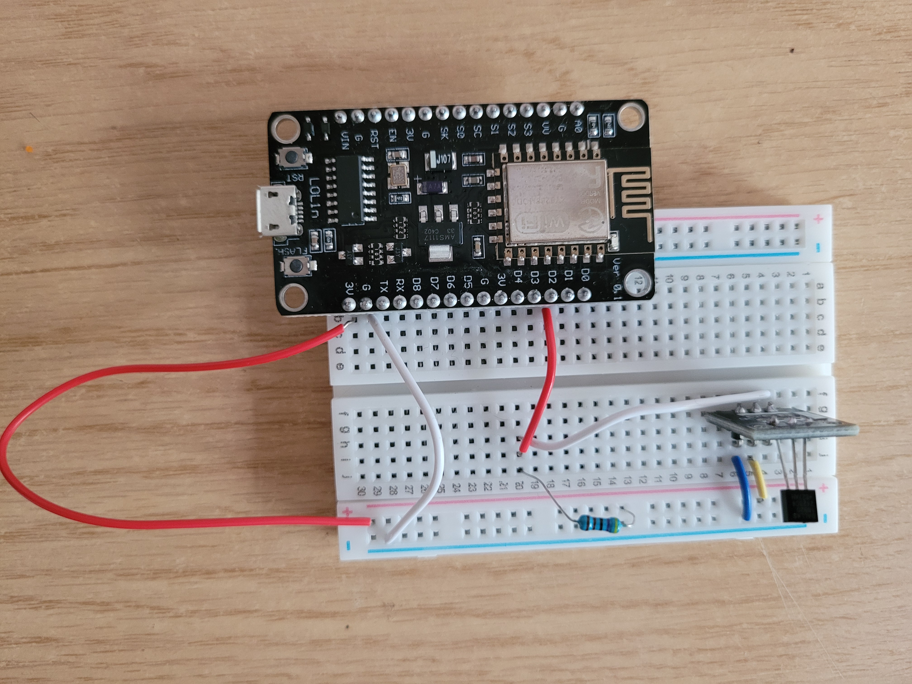

# ESP8266 Temperature Monitor with Web Interface

This project uses an **ESP8266** (NodeMCU) and a **DS18B20** temperature sensor to measure ambient temperature and display it on a simple web interface over Wi-Fi.

## Components

- ESP8266 (NodeMCU or similar)
- DS18B20 temperature sensor
- 4.7kΩ pull-up resistor
- Breadboard & jumper wires
- Micro USB cable

## Wiring

## Software Requirements

- **Arduino IDE**
- Libraries:
  - `OneWire`
  - `DallasTemperature`
  - `ESP8266WiFi`
  - `ESP8266WebServer`

## Setup and running

1. Connect the DS18B20 sensor to the ESP8266 as shown.
2. Install required libraries in the Arduino IDE.
3. Open the provided `.ino` file.
4. Update the Wi-Fi SSID and password in the code.
5. Upload the sketch to your ESP8266.
6. Open the Serial Monitor to find the device IP address.
7. Open a browser and navigate to the IP to view real-time temperature.

## Web Interface

The ESP8266 hosts a lightweight webpage that displays the current temperature in Celsius. The page auto-refreshes at set intervals to show the latest temperature readings.
